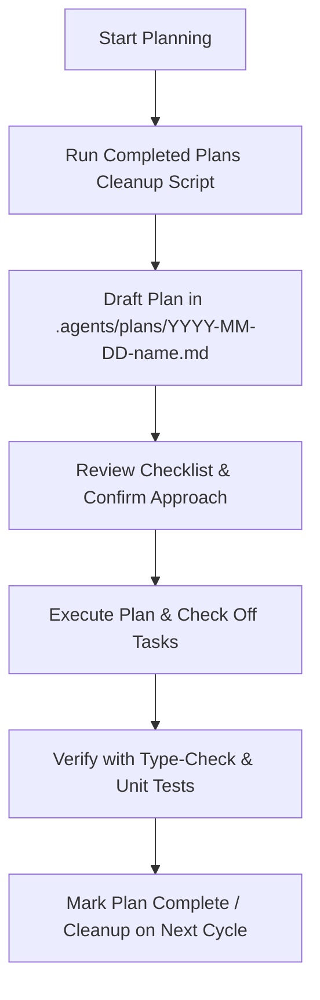

# Planning Skill: Large Refactors & Features

This skill defines the standardized planning workflow for any non-trivial development task in `localise.travel`. It ensures changes are well-architected, tracked with actionable checklists, and that completed plans are cleanly retired.

---

## When to Use This Skill

Activate and follow this skill whenever you are tasked with:
- **Large Refactors:** Overhauling stores, restructuring components, changing data formats in `src/data/`, or replacing libraries.
- **Major Features:** Adding new languages (`src/data/words/`), implementing audio playback / TTS, creating new views or modals, implementing offline search indexes.
- **Architectural Changes:** Modifying PWA service worker strategies, Vite build pipeline adjustments, state persistence migrations.
- **Multi-step Bug Fixes:** Any fix spanning multiple files with dependencies across stores, router, and UI components.

---

## Planning Workflow

Before modifying any source code for a large feature or refactor, execute the following 4-step workflow:



### Step 1: Clean Up Old Completed Plans
Before creating a new plan, ensure completed plans are deleted to prevent clutter:
```bash
bash .agents/skills/planning/scripts/cleanup-completed-plans.sh
```

### Step 2: Create a Plan File
Create a new file in `.agents/plans/` using the naming format:
`.agents/plans/YYYY-MM-DD-<feature-or-refactor-name>.md`

### Step 3: Structure the Plan
Every plan file must adhere to the standard template below, including a clear checklist.

#### Plan Template:
```markdown
# Plan: <Feature or Refactor Title>

- **Date:** YYYY-MM-DD
- **Status:** In Progress <!-- Options: Draft | In Progress | Completed -->
- **Owner/Agent:** AI Agent / Pair Programmer
- **Objective:** <Concise summary of what is being built or refactored>

## 1. Context & Architectural Impact
- **Affected Areas:** `src/data/`, `src/stores/`, `src/components/`, etc.
- **Design Decisions:** <Key architectural trade-offs or technical decisions>
- **Potential Risks / Breaking Changes:** <What could break and how to prevent it>

## 2. Implementation Checklist
- [ ] **Phase 1: Preparation & Data Models**
  - [ ] Define types / update interfaces in `src/data/...`
  - [ ] Add unit test fixtures
- [ ] **Phase 2: Store / Business Logic**
  - [ ] Update or create Pinia store in `src/stores/...`
  - [ ] Add unit tests in `src/stores/__tests__/...`
- [ ] **Phase 3: UI & Components**
  - [ ] Update Vue components in `src/components/...` or `src/views/...`
  - [ ] Connect store state & actions
- [ ] **Phase 4: Verification & Quality Assurance**
  - [ ] Run `bun run type-check` (verify `vue-tsc` passes)
  - [ ] Run `bun test:unit` (verify all Vitest tests pass)
  - [ ] Run `bun run lint` (verify oxlint + eslint pass)

## 3. Verification Commands
```bash
bun run type-check
bun test:unit
bun run lint
```
```

### Step 4: Execute, Track, and Complete
1. Work sequentially through the checklist items.
2. Mark tasks complete as you finish them by changing `- [ ]` to `- [x]`.
3. Once all checklist tasks are done and verification commands pass, update `- **Status:** Completed`.
4. When a new plan is drafted in the future, the cleanup script will automatically retire this completed plan.

---

## Plan Cleanup Utility

This skill includes a script to detect and delete completed plans.

### Running the Script

```bash
# Preview completed plans that will be deleted
bash .agents/skills/planning/scripts/cleanup-completed-plans.sh --dry-run

# Delete all completed plans
bash .agents/skills/planning/scripts/cleanup-completed-plans.sh

# Force deletion of all plans regardless of status
bash .agents/skills/planning/scripts/cleanup-completed-plans.sh --all
```

### How the Script Identifies Completed Plans
A plan in `.agents/plans/` is considered completed if:
1. It contains `- **Status:** Completed` (or `Done`/`Finished`), OR
2. It contains at least one checked item `- [x]` / `- [X]` AND has **zero** unchecked items (`- [ ]`).
3. Note: `README.md` and `.gitkeep` are always preserved and never deleted.
